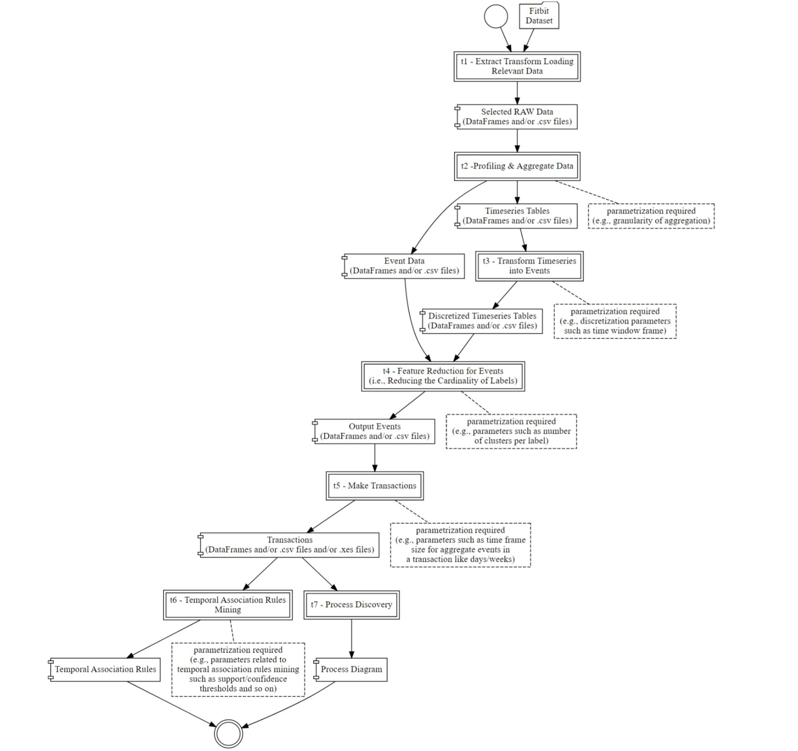

# An Analysis Playground for Wearable Data
Progetto per l'esame del corso di Estrazione e integrazione di conoscenza dai dati.

In collaborazione con [Michele Dalla Chiara](https://github.com/dallachiaram).

## Assegnamento
Implementare ciascuno dei task dall'1 al 7 ed integrarli secondo la pipeline sotto illustrata.

## Esecuzione del progetto
Scaricare il dataset fitbit dal sito [https://datasets.simula.no/pmdata/](https://datasets.simula.no/pmdata/) ed estrarlo in una directory denominata `pmdata`.

Aprire Jupyter ed eseguire i notebook corrispondenti ai vari task.
